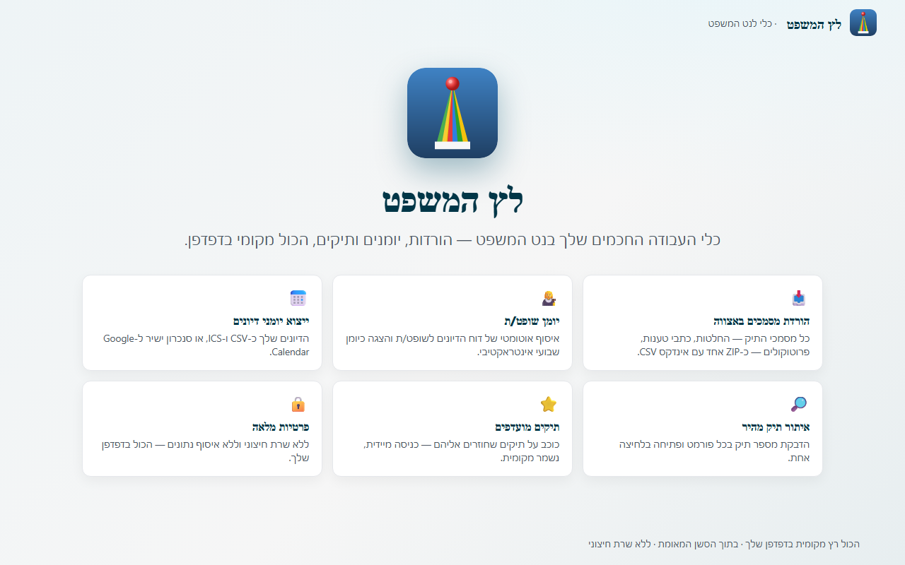
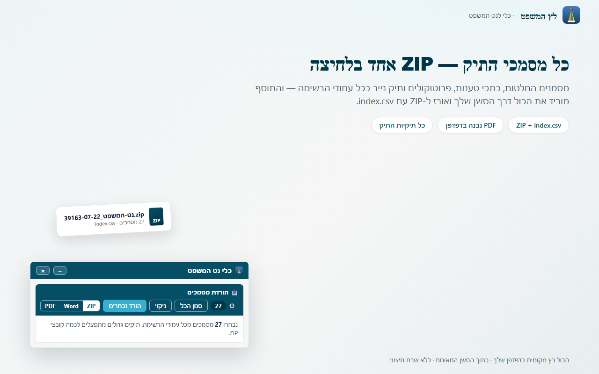
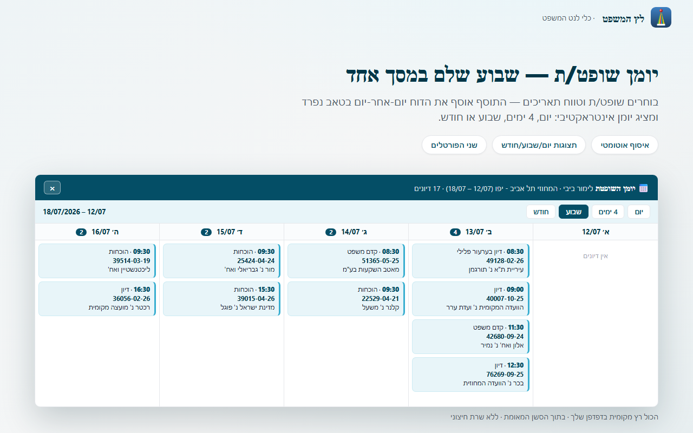
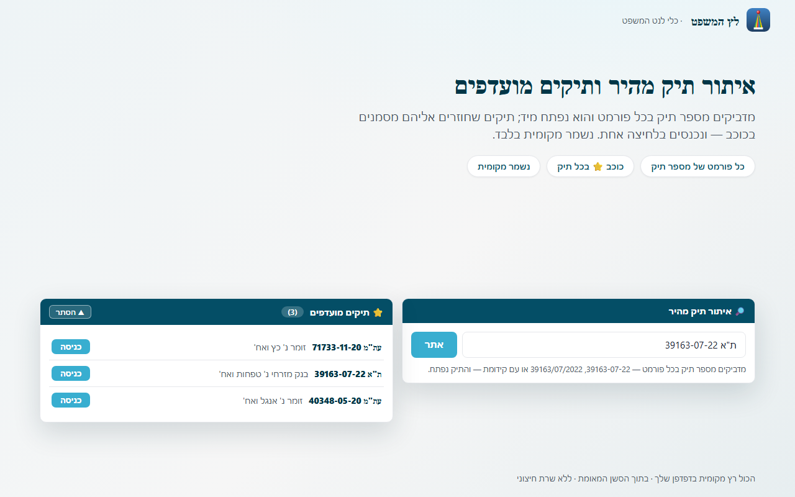
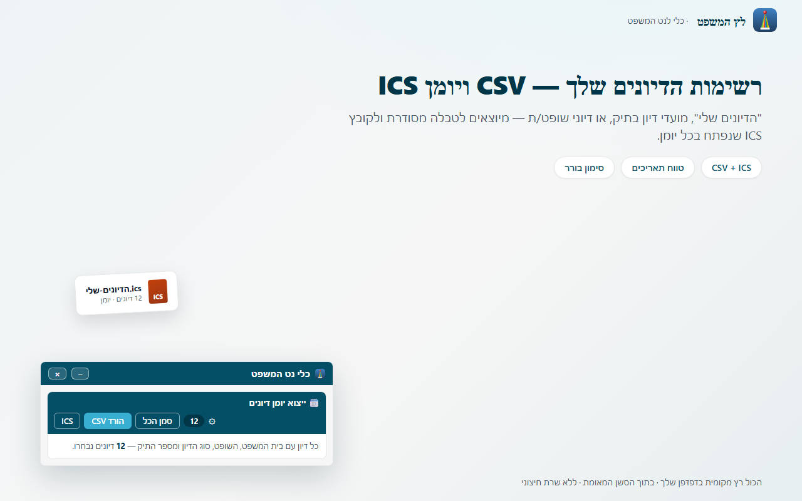

# לץ המשפט — תוסף דפדפן לנט המשפט ⚖️🃏

**לץ המשפט** מוסיף כלי עבודה מהירים למערכת **נט המשפט** של בתי המשפט בישראל —
הורדת מסמכים בבת אחת, ייצוא יומני דיונים, יומן שופט/ת, איתור תיק מהיר ותיקים
מועדפים. הכול רץ מקומית בדפדפן, בתוך הסשן המחובר של המשתמש.

**Chrome ו-Firefox נבנים מאותו קוד בדיוק, באותה גרסה** — עץ מקור אחד, שני יעדי בנייה.

> 🌐 [עמוד התוסף](https://www.z-g.co.il/court-downloader) · 🔒 [מדיניות פרטיות](https://www.z-g.co.il/court-downloader/privacy) · 📋 [היסטוריית גרסאות](CHANGELOG.md)



| | |
|---|---|
|  |  |
|  |  |

## מה התוסף עושה

- **📥 הורדת מסמכים באצווה** — סימון מסמכים מכל תיקיות התיק (החלטות, בקשות, כתבי טענות, פרוטוקולים, מוצגים, תיק נייר…) והורדה כ-ZIP אחד עם אינדקס CSV. ה-PDF נבנה בדפדפן (jsPDF) מתוך ה-viewer של האתר.
- **📅 יומני דיונים** — ייצוא רשימות דיונים (כולל "הדיונים שלי" חוצה-תיקים בטווח תאריכים) כ-CSV + ICS, או סנכרון ישיר ל-Google Calendar.
- **👩‍⚖️ יומן שופט/ת** — איסוף אוטומטי של דוח "דיונים לשופט ליום דיונים" על פני טווח תאריכים והצגתו כיומן שבועי/חודשי אינטראקטיבי. עובד גם בפורטל הציבורי וגם במאובטח.
- **🔎 איתור תיק מהיר** — הדבקת מספר תיק בכל פורמט (`39163-07-22`, `39163/07/2022`, `ת"א 39163-07-22`) ופתיחה בלחיצה אחת.
- **⭐ תיקים מועדפים** — סימון תיקים בכוכב וכניסה מהירה אליהם; נשמר מקומית בלבד.
- **☁️ יעדים אופציונליים** — לצד ה-ZIP המקומי: שרת API אישי (multipart + `X-API-Key`) או Google Drive. מופעלים רק אם המשתמש הגדיר אותם, עם ההרשאות שלו.

שתי תצורות תצוגה לכל פיצ'ר: **מוטמע** בתוך עמודי האתר, או **חלונית צפה**.

## פרטיות ואבטחה

- אין שרת של התוסף. שום נתון לא נשלח לשום מקום כברירת מחדל — הכול נשאר בדפדפן.
- התוסף רץ בתוך הסשן הקיים של המשתמש ולא נוגע בסיסמאות/עוגיות; הוא לא מבצע הזדהות בשם המשתמש.
- יעדי Drive/Calendar משתמשים ב-OAuth של Google בהיקפים מינימליים (`drive.file`, `calendar`); שרת ה-API והמפתח מוזנים ע"י המשתמש ונשמרים ב-`storage`.
- אין קוד מרוחק: כל הספריות (jsPDF, JSZip) ארוזות בתוסף.

פירוט: [PRIVACY_POLICY.md](PRIVACY_POLICY.md) · [SECURITY.md](SECURITY.md) · [תרשים זרימת נתונים](docs/chrome-web-store/REVIEWER_NOTES.md).

## מבנה הריפו

```
src/           עץ המקור היחיד — שני הדפדפנים נבנים ממנו
docs/
├── screenshots/       צילומי מסך ממותגים (1280×800, משמשים לשתי החנויות)
├── chrome-web-store/  טקסטי רישום + הערות לבוחן של CWS
├── firefox-amo/       מדריך העלאה ל-AMO והגדרת OAuth לפיירפוקס
├── testing/           צ'קליסט רגרסיה + תוכניות בדיקה
└── site/              נוסחי עמודי האתר (בית / פרטיות / תנאים)
```

## בנייה ובדיקות

```bash
cd src
npm ci                 # jsdom — תלות הפיתוח היחידה
npm test               # 289 בדיקות jsdom, ללא רשת
npm run build:all      # בונה את שתי החבילות: כרום + פיירפוקס
```

| פקודה | פלט |
|---|---|
| `npm run build` | `dist/extension-v<version>.zip` — ל-Chrome Web Store |
| `npm run build:firefox` | `dist/firefox-extension-v<version>.zip` — ל-AMO, וגם `dist/firefox/` לא ארוז |
| `npm run build:all` | שתיהן, מאותה גרסה |

**איך זה עובד:** קובץ אחד בלבד נבדל בין הדפדפנים — המניפסט. `build-zip.js` ממיר
אותו ליעד פיירפוקס (background מ-service worker ל-event page, הוספת
`browser_specific_settings.gecko` עם המזהה הקבוע והצהרת "לא אוסף מידע", והסרת
מפתח `oauth2` שקיים רק בכרום). כל שאר הקבצים זהים בייט-בבייט. חוזה זה מקובע
בבדיקות (`tests/dual-build.test.js`) כדי שלא יישבר בשקט.

בקוד יש שני מנגנוני התאמה בלבד: שים תאימות `chrome`↔`browser`
(`shared/browser-compat.js`, נטען ראשון בכל הקשר), וזיהוי יכולת ב-service worker
שבוחר בין `identity.getAuthToken` (כרום) ל-`identity.launchWebAuthFlow` (פיירפוקס).

## התקנה לפיתוח

- **Chrome/Edge:** `chrome://extensions` → מצב מפתח → "טעינת תוספת לא ארוזה" → בחירת `src/`.
- **Firefox:** `npm run build:firefox`, ואז `about:debugging` → "Load Temporary Add-on" →
  בחירת `src/dist/firefox/manifest.json` (המניפסט המותמר קיים רק בתוצר הבנייה).

> ⚠️ אין להשאיר את גרסת החנות מותקנת לצד העותק המקומי — שני עותקים חולקים מצב עמוד
> ומשבשים זה את זה. פירוט: [docs/testing/TESTING.md](docs/testing/TESTING.md).

**בדיקות רגרסיה:** כל גרסה נבדקת ביחידות (jsdom) וגם חי — על שני הדומיינים
(הציבורי + המאובטח), בשתי תצורות התצוגה, **ובשני הדפדפנים**.

## English (in brief)

**Letz HaMishpat** ("The Court Jester") is an MV3 browser extension that adds power
tools to Israel's *Net HaMishpat* court portal: bulk document download (ZIP + CSV
index, PDFs built client-side), hearing-list export (CSV/ICS/Google Calendar), an
interactive judge-docket calendar, instant case locate, and local favorites.
Everything runs client-side inside the user's own authenticated session; optional
Drive/Calendar/API destinations are user-configured. No remote code, no extension
server, no data collection.

**Chrome and Firefox ship from one source tree at the same version.** Only the
manifest differs, generated at build time (`npm run build:all`); a
`chrome`→`browser` shim and a capability check around the OAuth call are the only
code-level adaptations. `cd src && npm ci && npm test` runs the offline jsdom
suite. See [CHANGELOG.md](CHANGELOG.md) for the full version history.

## רישיון

[MIT](LICENSE) © Guy Zomer. קוד הסקרייפר/השרת הנלווה אינו חלק מריפו זה.
